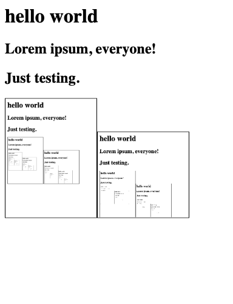

hello world
============

Lorem ipsum, everyone!
----------------------

Just testing.
-------------

<!-- 384 is the device width, but body has an 8px margin by default, so 384 - 16 = 368 -->
<!-- 

-->

